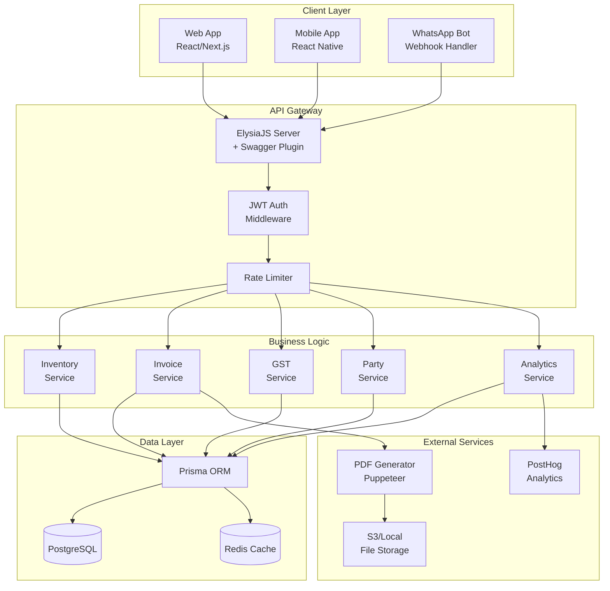
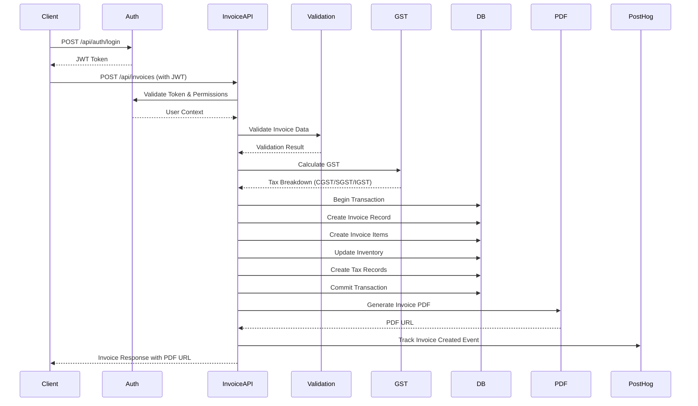
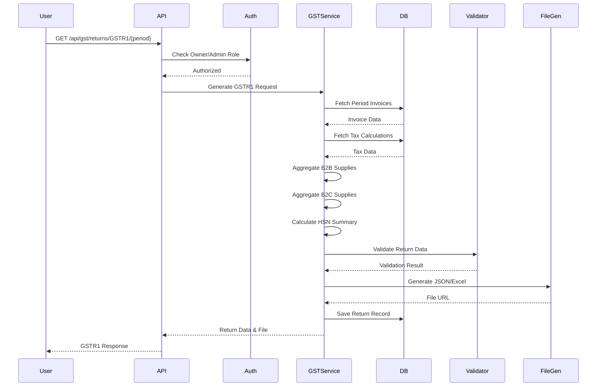
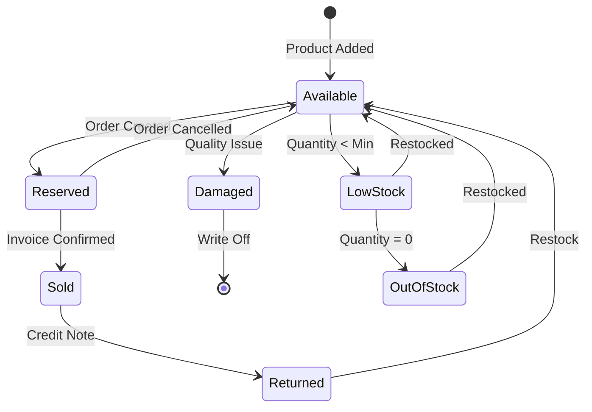
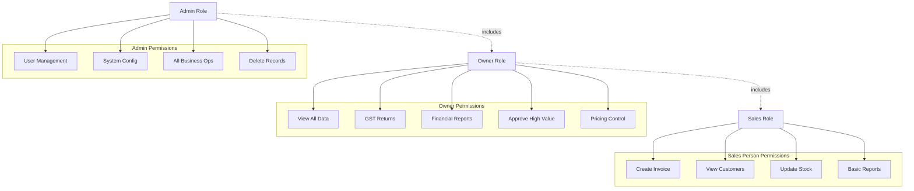
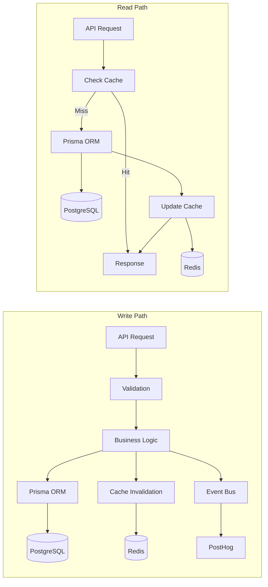
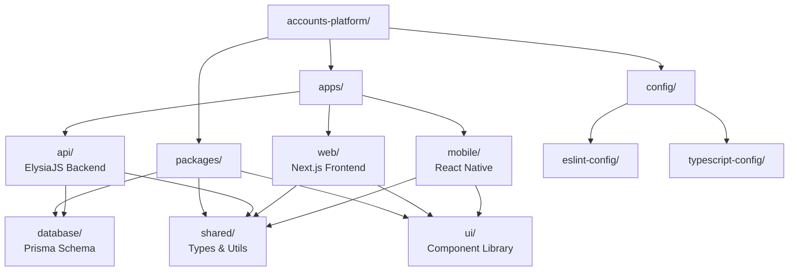
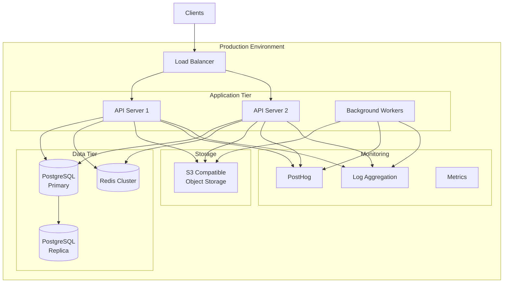

# Architecture Diagrams

## System Architecture with Tech Stack

## Invoice Creation Flow

## GST Return Generation Flow

## Inventory Management State Machine

## Role-Based Access Control

## Data Flow Architecture

## Monorepo Structure

## Deployment Architecture

